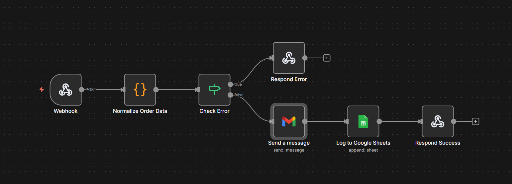

# E-commerce Order Notification Workflow

Professional automated order processing workflow for e-commerce stores. Sends beautifully formatted HTML order confirmation emails and logs orders to Google Sheets for analytics.

## 🎯 Features

- ✅ **Webhook Integration** - Compatible with WooCommerce, Shopify, and custom e-commerce platforms
- ✅ **HTML Email Notifications** - Professional, responsive email templates with order details
- ✅ **Google Sheets Logging** - Automatic order tracking and analytics
- ✅ **Error Handling** - Comprehensive validation and error responses
- ✅ **Data Normalization** - Handles multiple input formats (WooCommerce, Shopify, custom)
- ✅ **CORS Support** - Ready for frontend integration
- ✅ **Date Formatting** - Human-readable order dates in emails

## 📋 Workflow Architecture

```
Webhook → Normalize Order Data → Check Error
  ↓ (success)
Send HTML Email → Log to Google Sheets → Respond Success
  ↓ (error)
Respond Error (400/500)
```

## 🚀 Quick Start

### Prerequisites

- n8n instance (self-hosted or cloud)
- Gmail account with OAuth2 access
- Google Sheets with OAuth2 access

### Setup Steps

1. **Import Workflow**
   - Open n8n
   - Click "Import from File"
   - Select `workflow.json`

2. **Configure Gmail Credentials**
   - Go to "Credentials" → "Add Credential"
   - Select "Gmail OAuth2 API"
   - Follow OAuth2 setup instructions
   - Name it "Gmail Account"

3. **Configure Google Sheets Credentials**
   - Go to "Credentials" → "Add Credential"
   - Select "Google Sheets OAuth2 API"
   - Follow OAuth2 setup instructions
   - Name it "Google Sheets Account"

4. **Create Google Sheet**
   - Create a new Google Sheet
   - Add headers in row 1: `orderid`, `customeremail`, `ordertotal`, `orderstatus`, `timestamp`
   - Copy the Sheet ID from the URL (the long string between `/d/` and `/edit`)
   - Update the "Log to Google Sheets" node:
     - Set "Document" to your Sheet ID
     - Set "Sheet" to your sheet name (default: "Orders")

5. **Activate Workflow**
   - Toggle "Active" switch in the workflow editor
   - Copy the webhook URL from the Webhook node

## 📡 API Reference

### Endpoint

`POST /webhook/order-notification`

### Request Format

**WooCommerce Style:**
```json
{
  "id": "12345",
  "customer": {
    "name": "John Doe",
    "email": "customer@example.com"
  },
  "total": "99.99",
  "status": "confirmed",
  "items": [
    {"name": "Product 1", "quantity": 2},
    {"name": "Product 2", "quantity": 1}
  ]
}
```

**Shopify Style:**
```json
{
  "order_id": "12345",
  "customer_name": "John Doe",
  "customer_email": "customer@example.com",
  "order_total": 99.99,
  "order_status": "pending",
  "line_items": [
    {"name": "Product 1", "quantity": 2}
  ]
}
```

### Response Format

**Success (200):**
```json
{
  "success": true,
  "message": "Order notification sent",
  "orderId": "12345"
}
```

**Error (400):**
```json
{
  "success": false,
  "error": "Missing required order data"
}
```

## 🔒 Security Best Practices

1. **Webhook Authentication** (Recommended)
   - Add authentication to the Webhook node
   - Use API keys or OAuth2 tokens
   - Validate request signatures

2. **CORS Configuration**
   - Update `Access-Control-Allow-Origin` header
   - Replace `*` with your specific domain in production
   - Example: `https://yourstore.com`

3. **Environment Variables**
   - Store sensitive data in n8n environment variables
   - Never commit credentials to version control

4. **Rate Limiting**
   - Consider adding rate limiting for production use
   - Prevent abuse and ensure fair usage

## 📊 Google Sheets Structure

The workflow expects the following columns in your Google Sheet:

| Column | Type | Description |
|--------|------|-------------|
| `orderid` | String | Unique order identifier |
| `customeremail` | String | Customer email address |
| `ordertotal` | Number | Order total amount |
| `orderstatus` | String | Order status (pending, confirmed, shipped, etc.) |
| `timestamp` | DateTime | ISO 8601 timestamp of when order was logged |

## 🎨 Email Template

The workflow sends professional HTML emails with:
- Responsive design (mobile-friendly)
- Green header with "Thank You" message
- Order details card with formatted date
- Order items list
- Shipping notification message

## 🛠️ Customization

### Modify Email Template

1. Open "Send a message" (Gmail) node
2. Edit the `message` field HTML
3. Customize colors, fonts, and layout
4. Test with sample data

### Add Additional Fields

1. Update "Normalize Order Data" node JavaScript
2. Add new fields to the `order` object
3. Update Google Sheets column mapping
4. Add fields to email template

### Change Date Format

Edit the `formatDate` function in "Normalize Order Data" node:
```javascript
const options = { 
  year: 'numeric', 
  month: 'short', 
  day: 'numeric', 
  hour: '2-digit', 
  minute: '2-digit',
  hour12: true
};
```

## 📸 Screenshots



*Complete n8n workflow diagram showing all nodes and connections*

Additional screenshots (optional):
- `email-preview.png` - Sample HTML email output
- `google-sheets.png` - Sample Google Sheets data

## 🐛 Troubleshooting

### Email Not Sending
- Check Gmail OAuth2 credentials
- Verify email address format
- Check n8n execution logs

### Google Sheets Not Updating
- Verify Sheet ID is correct
- Check column headers match exactly
- Ensure OAuth2 credentials have write access

### Webhook Returns 400 Error
- Verify required fields: `id` (or `order_id`) and `customer.email` (or `customer_email`)
- Check request format matches expected structure
- Review execution logs in n8n

## 📝 Use Cases

- **E-commerce Order Management** - Automate order confirmations
- **Customer Communications** - Professional email notifications
- **Order Analytics** - Track orders in Google Sheets
- **Multi-platform Support** - Works with WooCommerce, Shopify, custom platforms
- **Inventory Management** - Integrate with inventory systems

## 🔗 Integration Examples

### WooCommerce
```php
wp_remote_post('https://your-n8n-instance.com/webhook/order-notification', [
    'body' => json_encode([
        'id' => $order->get_id(),
        'customer' => [
            'name' => $order->get_billing_first_name(),
            'email' => $order->get_billing_email()
        ],
        'total' => $order->get_total(),
        'status' => $order->get_status(),
        'items' => array_map(function($item) {
            return [
                'name' => $item->get_name(),
                'quantity' => $item->get_quantity()
            ];
        }, $order->get_items())
    ])
]);
```

### Shopify
Use Shopify's webhook system to send order data to this endpoint.

## 📄 License

MIT License - Feel free to use in your projects.

## 🤝 Contributing

Contributions welcome! Please ensure:
- Code follows best practices
- Security considerations are addressed
- Documentation is updated
- Tests are included (if applicable)

